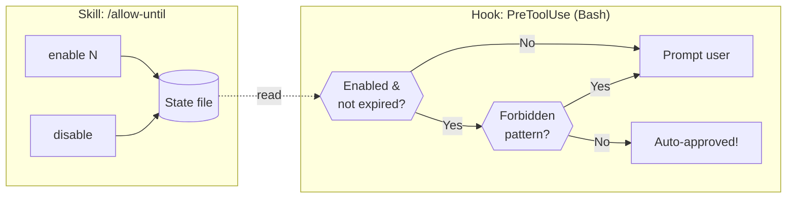

# allow-until

Time-limited auto-approval mode for Bash commands in Claude Code.

## Overview

This plugin provides a way to temporarily bypass permission prompts for Bash commands while still blocking dangerous operations. Useful when you want Claude to work autonomously for a limited time.

## Features

- **Time-limited approval**: Enable auto-approval for a specified duration (default: 10 minutes)
- **Safety first**: Dangerous commands (rm -rf, force push, etc.) always require confirmation
- **Customizable patterns**: Override default blocked patterns via environment variable
- **Pattern testing**: Verify which commands are blocked with `test-pattern`
- **Session-scoped**: Settings are isolated per Claude Code session
- **Simple commands**: Enable, disable, or check status with `/allow-until`

## Usage

### Enable auto-approval

```
/allow-until enable      # Enable for 10 minutes (default)
/allow-until enable 30   # Enable for 30 minutes
/allow-until 5           # Enable for 5 minutes
```

### Disable auto-approval

```
/allow-until disable
/allow-until off
```

### Check status

```
/allow-until status
```

## Forbidden Patterns

Certain dangerous commands (e.g. `rm -rf`, `git push --force`) are always blocked and require manual approval, even when auto-approve is enabled. Default patterns are defined in [`bin/allow-until.sh`](bin/allow-until.sh).

You can test whether a command would be blocked:

```
/allow-until test-pattern "rm -rf /tmp/foo"
/allow-until test-pattern "git push --force origin main"
```

### Customizing Patterns

Override the default patterns by setting the `SKILLS_ALLOW_UNTIL_FORBIDDEN_PATTERNS` environment variable. Patterns are semicolon-separated (`;`) bash regex.

When set, the environment variable **completely replaces** the default patterns.

#### Claude Code settings (recommended)

Set in `.claude/settings.json` or `.claude/settings.local.json`:

```json
{
  "env": {
    "SKILLS_ALLOW_UNTIL_FORBIDDEN_PATTERNS": "rm .*-(r.*f|f.*r|rf|fr);mkfs;dd if=;git push.*(--force| -f( |$))"
  }
}
```

#### Shell environment variable

```bash
export SKILLS_ALLOW_UNTIL_FORBIDDEN_PATTERNS="rm .*-(r.*f|f.*r|rf|fr);mkfs;dd if=;git push.*(--force| -f( |$))"
```

Use `/allow-until status` to see which patterns are currently active.

## Installation

```bash
claude plugin marketplace add pokutuna/claude-plugins
claude plugin install allow-until@pokutuna-plugins --scope user
```

> **Note:** We recommend installing with `--scope user` (default) rather than project scope. See [Recommendation](https://github.com/pokutuna/claude-plugins#recommendation) for details.

## How it works



1. The plugin registers a `PreToolUse` hook for Bash commands
2. When `/allow-until enable` is called, it stores an expiration timestamp
3. Before each Bash command, the hook checks:
   - Is auto-approval enabled and not expired?
   - Is the command safe (not in the blocked list)?
4. If both conditions are met, the command is auto-approved
5. Otherwise, no output is produced and Claude Code falls back to prompting the user

Session state is stored in `${XDG_STATE_HOME:-~/.local/state}/claude-allow-until.conf` using git-config format.
