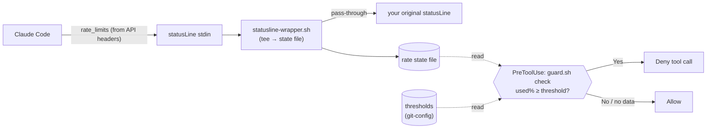

# limit-usage

Stop tool execution before you exhaust your Claude rate limit.

## Overview

When a rate-limit window (5-hour or 7-day) passes a usage threshold you set, this plugin **denies further tool calls** so you don't burn through your remaining quota. Usage is read from the data Claude Code already feeds your `statusLine` — so measuring it costs **zero extra quota** (no `claude -p`, no OAuth token, no API calls).

## Features

- **Zero metering cost**: usage % is captured from the normal statusLine stream, not by spending quota to ask.
- **Per-window thresholds**: independently limit the 5-hour and 7-day windows.
- **Session or global scope**: set a limit for the current session or for all sessions (`--global`).
- **Non-destructive install**: wraps your existing statusLine command, preserving its display; one-command `uninstall` restores it.
- **Fail-open**: no usage data, stale data, or no threshold → tools run normally. It only blocks on a confirmed breach.

## Usage

### One-time install (required)

The guard can only see usage after your statusLine is wrapped to capture it.

```
/limit-usage install
```

The skill reads your `settings.json`, shows a before/after diff, and edits `statusLine.command` **only after you confirm**. Your status line display is unchanged; the original command is saved for restore.

### Set thresholds

```
/limit-usage set 5h 80%        # stop when the 5-hour window is 80% used (this session)
/limit-usage set 7d 90%        # stop when the 7-day window is 90% used (this session)
/limit-usage set 5h 80% --global   # apply to all sessions
```

The number is **used_percentage** (0–100): `80` means "80% used / 20% left".

### Clear thresholds

```
/limit-usage off         # clear both windows (this session)
/limit-usage off 5h      # clear only the 5h window
/limit-usage off --global
```

### Check status

```
/limit-usage status      # effective thresholds + current usage + snapshot age
```

### Restore your statusLine

```
/limit-usage uninstall
```

## Requirements

- `jq` on PATH.
- A Claude.ai subscription (Pro / Max / Team / Enterprise). The `rate_limits` data only appears for subscriptions, and only after the first API response of a session — free tier never triggers the guard.

## Installation

```bash
claude plugin marketplace add pokutuna/claude-plugins
claude plugin install limit-usage@pokutuna-plugins --scope user
```

> **Note:** We recommend installing with `--scope user` (default). See [Recommendation](https://github.com/pokutuna/claude-plugins#recommendation) for details.

After installing, run `/limit-usage install` once, then set your thresholds.

## How it works



1. Claude Code passes a JSON blob (including `rate_limits`) to the statusLine command on stdin. This is the only hook surface that receives it.
2. `install` wraps your statusLine with `statusline-wrapper.sh`, which tees the usage % into a state file and replays stdin to your original command unchanged.
3. A `PreToolUse` hook runs `guard.sh check` before every tool call. It compares the captured usage against your thresholds (resolving session → global) and emits a `deny` decision when a window is at or over its limit.
4. If there's no snapshot, the snapshot is stale, or no threshold is set, the guard stays silent and the tool runs.

## State files

- `${XDG_STATE_HOME:-~/.local/state}/cc-limit-usage-rate.json` — latest usage snapshot (written by the wrapper).
- `${XDG_STATE_HOME:-~/.local/state}/cc-limit-usage.conf` — thresholds + saved original statusLine, git-config format.

Snapshots older than 5 minutes are treated as stale (fail-open). Override with `LIMIT_USAGE_STALE_SECONDS`.

## Uninstall

1. `/limit-usage uninstall` to restore your statusLine.
2. `claude plugin uninstall limit-usage@pokutuna-plugins` to remove the hook.
3. Optionally remove the state files listed above.
