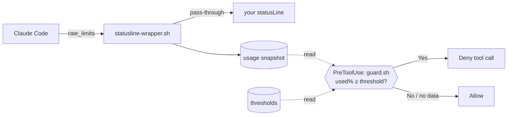

# limit-usage

Stop tool execution before you exhaust your Claude rate limit.

## Overview

Set a usage threshold for a rate-limit window (5-hour or 7-day), and once that window passes it, the plugin **denies further tool calls** so you don't burn through your remaining quota. Usage is read from the data Claude Code already feeds your `statusLine`, so measuring it costs **zero extra quota** — no `claude -p`, no OAuth token, no API calls. It fails open: with no usage data or no threshold, tools run normally.

Requires `jq` and a Claude.ai subscription (Pro / Max / Team / Enterprise) — `rate_limits` only appears for subscriptions, after the session's first API response.

## Install

```bash
claude plugin marketplace add pokutuna/claude-plugins
claude plugin install limit-usage@pokutuna-plugins --scope user
```

> **Note:** We recommend `--scope user` (default). See [Recommendation](https://github.com/pokutuna/claude-plugins#recommendation).

## Usage

**First, run the one-time setup** — the guard can only see usage after your statusLine is wrapped to capture it:

```
/limit-usage-setup install
```

It shows the before/after and edits `statusLine.command` (the edit goes through Claude Code's normal file-permission prompt). Your status line display is unchanged. (Setup is a separate skill so the everyday `/limit-usage` commands need no edit permission.) Re-run it after a plugin update to refresh the wrapper.

Then set thresholds and check status:

```
/limit-usage 5h=80             # stop when the 5h window is 80% used (this session)
/limit-usage 5h=80 7d=90       # set both windows in one go
/limit-usage 7d=90 --global    # apply to all sessions
/limit-usage off [5h|7d]       # remove one window's threshold (or both) in one scope
/limit-usage clear             # remove every threshold in effect now (this session + global)
/limit-usage status            # thresholds + current usage
```

The number is **used_percentage** (0–100): `80` means "80% used / 20% left". Run `/limit-usage-setup uninstall` to restore your original statusLine.

## How it works



1. Claude Code feeds `rate_limits` (from API headers) to the `statusLine` command on stdin — the only hook surface that receives it.
2. `/limit-usage-setup install` wraps your statusLine with `statusline-wrapper.sh`, which tees the usage % into a state file and replays stdin to your original command unchanged.
3. A `PreToolUse` hook runs `guard.sh` before each tool call, compares the captured usage against your thresholds (session → global), and denies once a window is at or over its limit.
4. No snapshot, a stale snapshot (>5 min, override `LIMIT_USAGE_STALE_SECONDS`), or no threshold → the guard stays silent and the tool runs.

State lives in `${XDG_STATE_HOME:-~/.local/state}/cc-limit-usage-*` (usage snapshot + git-config thresholds). To remove the plugin entirely: `/limit-usage-setup uninstall`, then `claude plugin uninstall limit-usage@pokutuna-plugins`.
