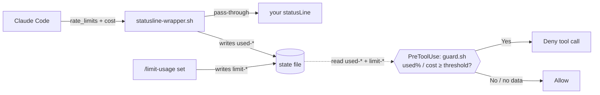

# limit-usage

Stop tool execution before you exhaust your Claude rate limit.

## Overview

Set a threshold and once you pass it, the plugin **denies further tool calls** so you don't burn through your usage. Two kinds of threshold:

- **Usage %** for a rate-limit window (`5h` / `7d`) — for plans that have a usage quota (Pro / Max / Team / Enterprise).
- **Cost** — this session's **approximate cumulative USD**. Use this when `5h`/`7d` aren't reported, i.e. a plan with no usage quota.

Both are read from the data Claude Code already feeds your `statusLine`, so measuring costs **zero extra quota** — no `claude -p`, no OAuth token, no API calls. It fails open: with no data or no threshold, tools run normally.

> **`cost` is per-session.** `cost` is reported for every session (subscription and API alike) as that session's own cumulative spend. The snapshot keeps each session's cost separate (and the account-wide `5h`/`7d` figures shared), so running several sessions at once is fine — each one's `cost` limit tracks only its own spend, and `5h`/`7d` reflect the whole account. A `cost` limit covers a single session, not the combined spend of all of them.

Requires `jq`. The thresholds appear only after the session's first API response; if status never shows a `5h`/`7d` figure, your plan has no usage quota — use a `cost` limit instead.

## Install

```bash
claude plugin marketplace add pokutuna/claude-plugins
claude plugin install limit-usage@pokutuna-plugins --scope user
```

> **Note:** We recommend `--scope user` (default). See [Recommendation](https://github.com/pokutuna/claude-plugins#recommendation).

## Usage

**First, run the one-time setup** — the guard can only see usage after your statusLine is wrapped to capture it:

```
/limit-usage-setup install
```

It shows the before/after and edits `statusLine.command` (the edit goes through Claude Code's normal file-permission prompt). Your status line display is unchanged. (Setup is a separate skill so the everyday `/limit-usage` commands need no edit permission.) Re-run it after a plugin update to refresh the wrapper.

Then set thresholds and check status:

```
/limit-usage 5h=80             # stop when the 5h window is 80% used (this session)
/limit-usage 5h=80 7d=90       # set both windows in one go
/limit-usage cost=$5           # stop once this session reaches ~$5 (cost=5 / $5 also work)
/limit-usage 7d=90 --global    # apply to all sessions (5h/7d only)
/limit-usage clear             # remove every threshold in effect now (this session + global)
/limit-usage status            # thresholds + current usage
```

For `5h`/`7d` the number is **used_percentage** (0–100): `80` means "80% used / 20% left", and `--global` applies it to every session. For `cost` it's an **approximate USD** amount Claude Code estimates, so treat it as a rough cap; it is **per-session only** (a session's cost doesn't add up across sessions, so `--global` isn't allowed for it). Run `/limit-usage-setup uninstall` to restore your original statusLine.

## How it works



1. Claude Code feeds the `statusLine` command a stdin blob that carries `rate_limits` (5h/7d usage %, present only on plans with a usage quota) and `cost` (session cost, estimated by Claude Code) — the only hook surface that receives them.
2. `/limit-usage-setup install` wraps your statusLine with `statusline-wrapper.sh`, which records the measured figures into the state file — `5h`/`7d` under `[global]` (account-wide), `cost` under `[session "<id>"]` (per-session) — and replays stdin to your original command unchanged.
3. A `PreToolUse` hook runs `guard.sh` before each tool call, compares the captured `used-*` figures against your `limit-*` thresholds (`5h`/`7d`: session → global; `cost`: this session), and denies once any window is at or over its limit.
4. No snapshot, a stale snapshot (>5 min, override `LIMIT_USAGE_STALE_SECONDS`), or no threshold → the guard stays silent and the tool runs.

State is one git-config file, `${XDG_STATE_HOME:-~/.local/state}/cc-limit-usage.conf`, sectioned by scope: `[global]` holds account-wide measured usage (`used-5h`/`used-7d`) and `--global` thresholds; `[session "<id>"]` holds that session's measured cost (`used-usd`) and thresholds. The wrapper writes only the `used-*` figures, `set`/`clear` write only the `limit-*` thresholds. To remove the plugin entirely: `/limit-usage-setup uninstall`, then `claude plugin uninstall limit-usage@pokutuna-plugins`.
