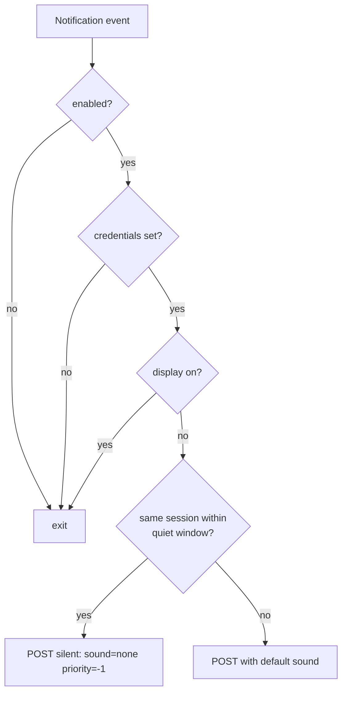

# pushover-notify

Send [Pushover](https://pushover.net/) push notifications from Claude Code — automatically when Claude needs your attention, or on demand when you (or Claude) want to push a message to your phone.

## Features

Two entry points share one bundled CLI (`bin/notify.sh`):

**Automatic hook** (`Notification` event)
- Fires on idle prompts and permission requests
- **Display-aware (macOS)**: skips sending when the display is on, so you only get pinged when you're actually away
- **Context-rich body**: title shows the repository name (cwd basename); body includes the hook message plus a short excerpt of the last assistant turn so you can tell at a glance what finished
- **Per-session quiet window**: 180 seconds. Repeats from the *same* session are delivered silently (`sound=none`, low priority); a different session always plays a sound
- **Disabled by default**: opt-in via the `pushover-notify` skill (`pushover on`)
- Silent on failure: hook never disrupts Claude Code

**On-demand `send`** (skill / user / AI)
- Full-featured `pushover` CLI built in: title, priority, sound, attachment, URL, stdin, presets (`--done` / `--error` / `--emergency`)
- Ignores the enable flag — explicit action by you or the assistant
- Trigger with phrases like "pushover で通知して", "終わったら pushover で知らせて"

## Installation

```bash
claude plugin marketplace add pokutuna/claude-plugins
claude plugin install pushover-notify@pokutuna-plugins --scope user
```

## Setup

1. Create a Pushover account and application: <https://pushover.net/>
2. Set credentials in your shell rc file (`~/.zshrc`, `~/.bashrc`, etc.) so
   they are inherited by the Claude Code process — the hook runs in a subshell
   of whichever shell launched Claude Code:

   ```bash
   export PUSHOVER_TOKEN="your-app-token"
   export PUSHOVER_USER="your-user-key"
   ```

   If you launch Claude Code from a GUI app (Spotlight, Raycast, launchctl),
   the variables must be present in that launcher's environment as well.

3. Enable notifications by asking Claude in natural language:

   ```
   pushover on
   ```

## Usage

The plugin exposes a Skill that covers both responsibilities.

**Toggle the auto-notification hook** (natural language):

- `pushover on` / `pushover off` — enable / disable
- `pushover toggle` — flip current state
- `pushover status` — show state, credentials, display detection, last sent

**Send a notification now** (skill / user / AI):

- `pushover で「終わった」って通知して`
- `ビルド完了したら pushover で知らせて` (Claude が完了時に `send --done` を呼ぶ)
- `エラーになったら pushover で alert 出して` (`send --error`)

Internally these run `${CLAUDE_PLUGIN_ROOT}/bin/notify.sh send [OPTIONS] [MESSAGE]`. Options mirror a standalone `pushover` CLI: `-t/--title`, `-p/--priority`, `-s/--sound`, `-a/--attach`, `-u/--url`, `-U/--url-title`, `-q/--quiet`, plus presets `--done` / `--error` / `--emergency`. Stdin is read when MESSAGE is omitted. Run `notify.sh send --help` for full details.

Example `pushover status` output:

```
Pushover notifications: true
PUSHOVER_TOKEN: set
PUSHOVER_USER: set
jq: available
Display: off (notifications sent)
Last sent: 2026-05-23 14:32:10
Last session: 0a45e281-ad01-4040-84de-2c1caf1d3105
```

## How it works



The notification body is built from the hook's `message` field plus a short summary of the most recent assistant turn (last text block, or the last tool name if the turn was a tool call only). The title carries the repository name derived from `cwd`.

State is stored at `${XDG_STATE_HOME:-~/.local/state}/claude-pushover-notify.conf` in git-config format:

```
[global]
    enabled = true
    last-sent = 1730000000
    last-session = 0a45e281-ad01-4040-84de-2c1caf1d3105
```

## Display detection

On macOS, the script reads `pmset -g assertions` and skips notifications while the system-wide `UserIsActive` assertion is set to `1` — i.e. input devices are in use and the display is lit. The assertion is released about 180 seconds after the last input event (around the time the display sleeps), at which point notifications go through.

On non-macOS systems (or when `pmset` is unavailable), this check is skipped and notifications are always sent.

## Quiet window

A 180-second per-session window mutes the *sound* of repeat notifications from the same session. A notification is never dropped — it just arrives with `sound=none` and `priority=-1` so it shows up in the notification center without audio. Notifications from a different session always play a sound, so you hear new sessions:

| Scenario within 180s of last send | Behavior |
|---|---|
| First notification (any session) | Sent with default sound |
| Same session, repeated prompt | Sent silently (`sound=none`, `priority=-1`) — still appears in notification center |
| Different session | Sent with default sound — you should hear new sessions |

## Environment variables

| Variable | Required | Description |
|----------|----------|-------------|
| `PUSHOVER_TOKEN` | yes | Pushover application token |
| `PUSHOVER_USER` | yes | Pushover user key |
